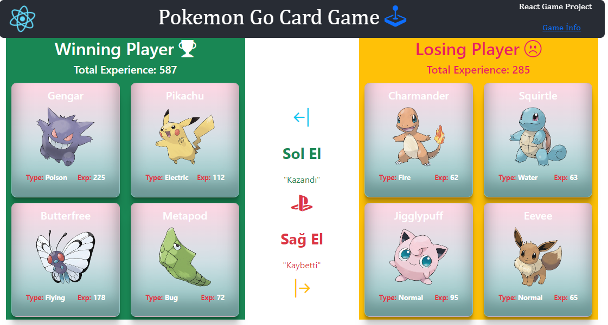

### React Project 6
# POKEMON GO CARD GAME

# React Props: Pokedex

- Project:
Pokegame Component»
Modify your component hierarchy so that App renders a component called Pokegame. Pokegame should take your list of 8 pokemon and randomly assign them into two hands of 4 cards each. It should then render two Pokedex components, one for each hand.

Once you’ve got this working, modify your Pokegame so that it also calculates the total experience for each hand of pokemon. It should pass this total to the Pokedex.

Next, have the Pokegame component determine which hand is the “winner,” where the winning hand is the one with the higher total experience. Then modify the Pokedex component one more time so that it accepts a prop of isWinner. If the Pokedex is the winning one, it should display the message “THIS HAND WINS!” at the bottom of the deck.
Now when you load the page, you should see two different hands with a randomly changing winner every time you refresh.

## Udemig Ödev projesidir...
-- API: https://raw.githubusercontent.com/PokeAPI/sprites/master/sprites/pokemon/${id}.png.

## Preview

# Getting Started with Create React App

This project was bootstrapped with [Create React App](https://github.com/facebook/create-react-app).

## Available Scripts

In the project directory, you can run:

### `npm start`

Runs the app in the development mode.\
Open [http://localhost:3000](http://localhost:3000) to view it in your browser.

The page will reload when you make changes.\
You may also see any lint errors in the console.
# Pokemon-Go-Card-Game
